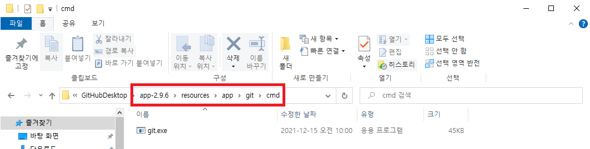

# cmd에서 git 이용하기
git 명령어를 cmd에서 사용하기 위해선 git을 설치 후 환경 변수에 git을 추가해 줘야 한다. linux, mac 등은 터미널에서 명령어를 통해 git을 설치할 수 있지만 윈도우는 터미널에서 git을 설치할 수 있는 방법이 없는 것으로 알고 있다.  

설치파일은 아래의 2가지 중 하나로 하면 되지만, PC에 GitHub Desktop이 설치되어져 있는 관계로 두번째 방법에 대해서만 설명하겠다.  

## 1. Git Bash 설치 
참고 : [윈도우에서 Git 설치하기][https://coding-factory.tistory.com/245]  
참고 : [Git Bash란 무엇인가][https://parkjh7764.tistory.com/39]

## 2. GitHub Desktop 설치 및 환경변수 설정 
#### 1) 아래의 주소로 접속하여 다운로드를 진행한다.
다운로드 주소 : [https://desktop.github.com/][https://desktop.github.com/]

#### 2) 설치된 프로그램 바로가기 우클릭 - 속성 - 파일 위치 열기
*바로가기를 찾지 못 했다면 아래 방법을 통해 접근 가능  
  

  

#### 3) 폴더 이동 및 주소 복사
*app-*.*.* 에서 버전 숫자는 달라도 상관없음

#### 4) 시스템 속성에서 환경변수 추가
#### 시스템 속성 열기 방법 - 1
내 PC 우클릭 - 속성 - 고급 시스템 설정  
 

#### 시스템 속성 열기 방법 - 2
 

#### 환경변수 추가
고급 - 환경변수 - 시스템 변수 - path - 편집 - 새로 만들기 - 3)의 주소 붙여넣기 - 확인  
 

#### 5) 테스트
터미널(명령 프롬프트, cmd 이하 동일)을 실행하여 git --version을 입력했을 때 버전 정보가 뜬다면 성공
#### 성공

#### 실패
환경변수를 바르게 추가했는데 git 명령어를 사용할 수 없다면, cmd를 새로 열어서 테스트하기  
  