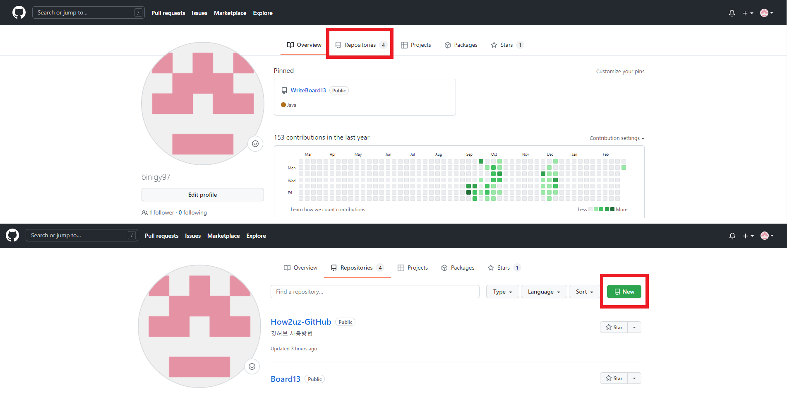
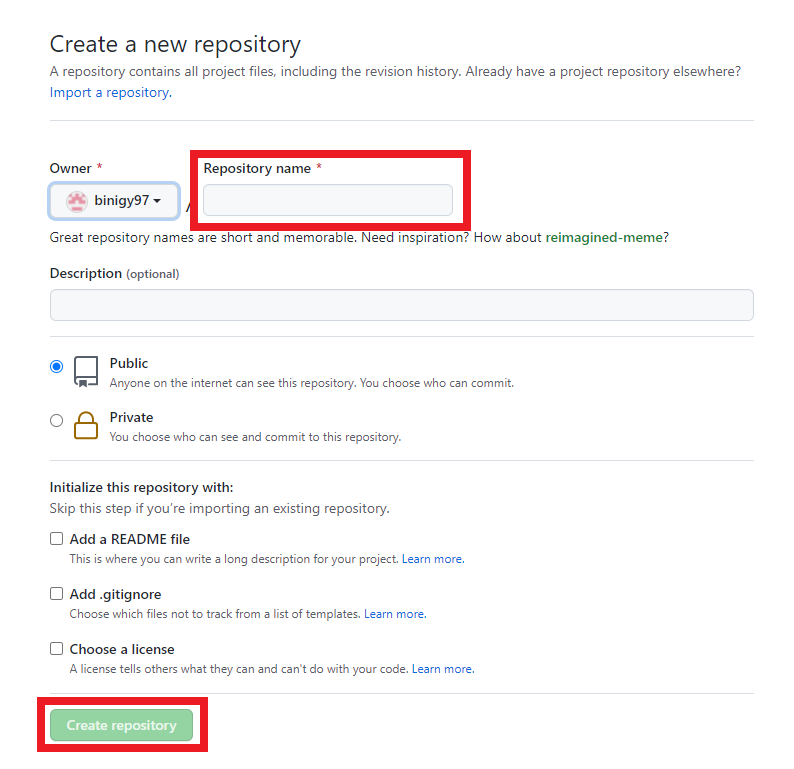
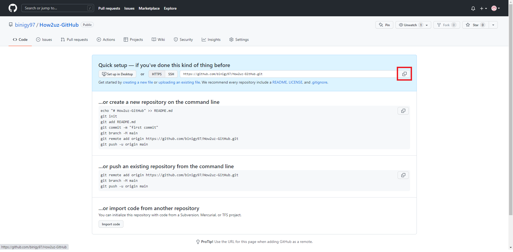
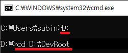
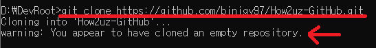
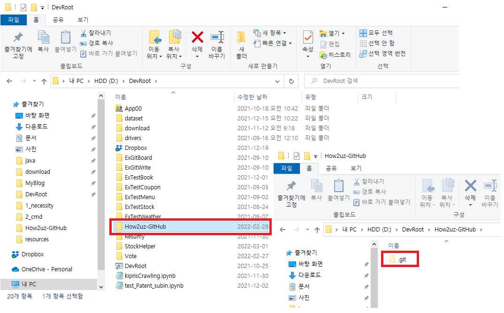
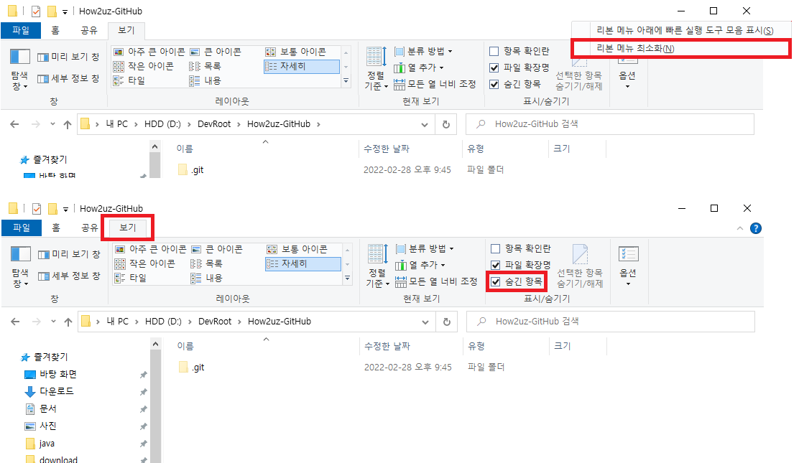

##### 용어
***
- 로컬 : 개인PC 
- Local repository(Working directory) : 로컬에서 소스파일을 작업하는 공간 
- Git repository : 원격저장소(Git 프로그램을 통해 파일이 저장되는 곳) 
- Github : 깃 원격저장소를 제공하는 회사(사이트) 중 하나 

# Github의 git repository과 로컬 연결하기
##### github 계정이 있다는 가정 하에 작성됨
***
## 1. git repository 생성
***
- github.com - repository - new

- 폼 기입 후 create repository

> - (필수)Repository name : 저장소의 이름, 사용자가 원하는 이름 입력 
> - (선택)Description : 선택 입력으로 저장소에 대한 설명(주석) 
> - (필수)Public, Private : 무료 계정인 경우 Public만 사용가능 
> - Initialize this repository with a README : 저장소 생성과 함께  README 파일이 설치 ( README파일은 코드의 정보가 담겨있다.)
> - (선택)Add.gitignore : 깃 허브로 올리지 않을 파일 선택 
> - (선택)Add a license : 저장소 생성과 함께 라이센스 팡리의 설치가 자동 수행 

- 깃 저장소 주소 복사 
로컬과 깃 저장소를 연결할 때 이용됨

## 2. cmd에서 로컬 저장소로 이동
***
cmd에서 소스코드를 작성할 디렉토리로 이동한다. 
- C 드라이브에서 D 드라이브로 이동할 땐, D:를 입력해준 뒤 cd(change directory) 
- <code>cd 이동할 경로</code> 

## 3. git 명령어를 이용해 로컬과 깃 저장소 연결
***
cmd에서 <code>git clone 깃저장소url</code>명령어로 연결하기 
warning 은 경고문구는, git repository에 아무런 파일도 없는데 이를 로컬과 연결했기 때문에 빈 폴더로 보인다는 뜻이다. 

.git 폴더가 있다면 정상적으로 연결이 완료된 것이다. 

.git은 숨긴 항목으로 설정되어져 있기 때문에, 빈 폴더로 보인다면 다음과 같이 파일 탐색기를 설정해주면 된다. 
