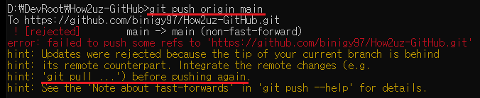
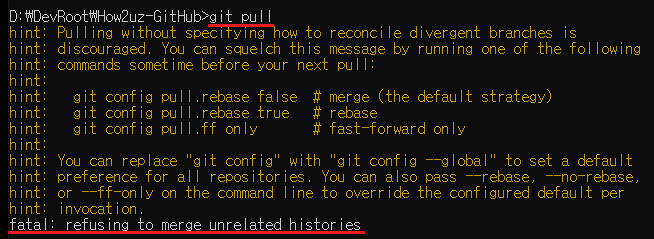
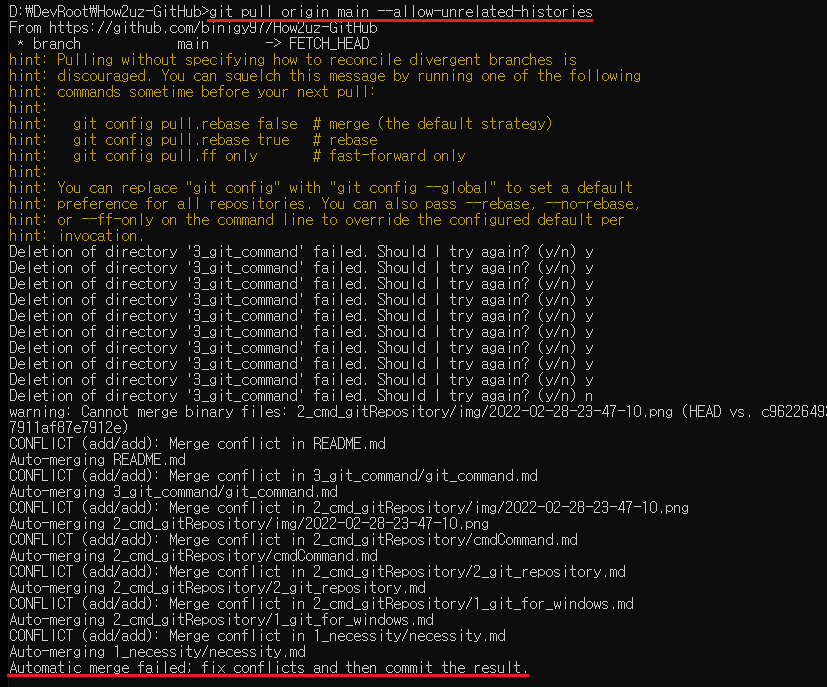
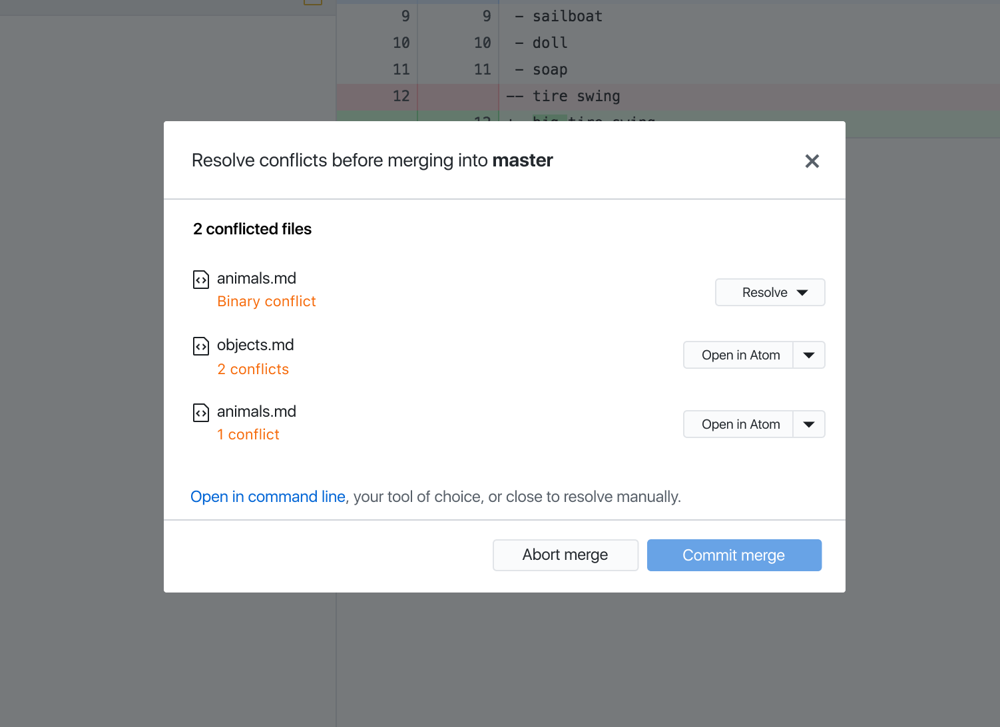

# 문제상황 및 해결과정
### 1) push 오류 : failed to push, fast-forwards
push를 하려고 하니까, 브랜치가 얽혔는지 push 이전에 pull을 하라고 한다.  
  

### 2) pull 오류1 : refusing to merge
이번엔 refusing to merge unrelated histories 오류가 떴다.  
  
git은 기본적으로, 서로 관련 기록이 없는 이질적인 두 프로젝트를 병합하는 것을 거부하기 때문에 일어나는 드문 현상이라고 한다. 따라서 pull을 할 때 이를 허용하는 옵션을 사용해주는 것이 해결 방안이라고 한다.  
```
  git pull origin main --allow-unrelated-histories
```
### 3) pull 오류2 : automatic merge failed
찾아보니 git merge를 이용할 때도 볼 수 있는 오류로, 오류 메세지를 보면 conflict(충돌)에 의한 자동 병합 실패임을 알 수 있다.  
  

이 경고가 뜨면, 텍스트 파일에는 git이 각 브랜치에서 충돌나는 부분을 적어놓는다. (<<<< HEAD ... ===== >>>> a32SDQ234 이런 식으로 뜬다.) 이를 모두 찾아서 충돌 부분을 수정한 뒤 add, commit을 해준다.  

### 4) 같은 상황 반복 (;GitHubDesktop merge conflict)
하지만, add와 commit을 해도 push를 하면 똑같은 오류가 떴다. 결국 cmd로 하는 건 포기하고 GitHubDesktop 프로그램을 이용해 문제를 해결해 보았다.  

과정은 다음과 같다.
1. automatic merge failed(과정3)이 발생하지 않게 커밋을 진행한 뒤 push를 수행하면 여전히 업데이트가 거부된다(과정1).
2. --allow-unrelated-histories 옵션으로 다시 pull을 진행한 뒤(과정2) GitHubDesktop 프로그램을 확인하면 아래와 같은 새로운 창이 뜬다.  
  
3. 모든 충돌 파일에 대하여 프로젝트 간 병합에 대한 드랍박스의 옵션을 선택하고 하단의 Commit Merge 버튼을 누르면 push/pull가 가능하다.

***
# 개선사항
모르겠다.. 어쩌다 해결한 거라서 다른 사람들의 글을 찾아보지도 못 했다..ㅠㅠ 왜 오류가 난건지도 모르겠다..ㅠㅠㅠ 찾아봐도 너무 어렵다ㅠㅠ  

 과정1에서 fast-forwards도 검색 키워드가 될 수 있다는 것을 이 글을 작성하며 깨달았다. https://rudolf-2434.tistory.com/44 다음엔 이 글도 참고해서 해결해봐야겠다.