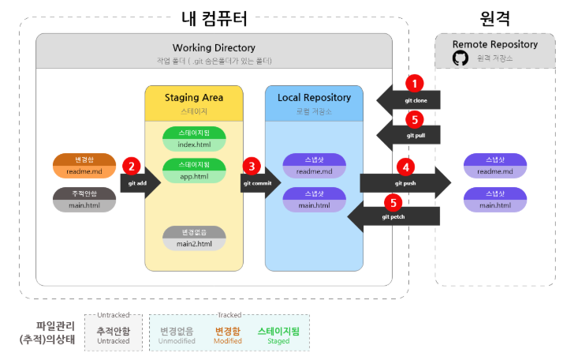
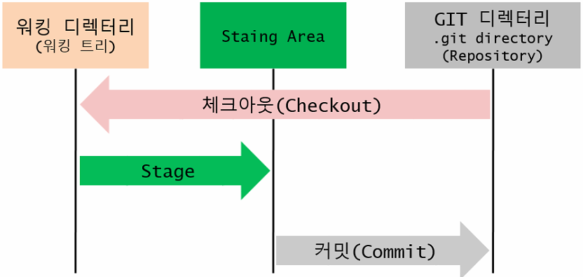

# Git과 Github의 차이점
### Git
- 로컬에서 버전을 관리하기 위해 사용하는 '프로그램' 
- 이 프로그램을 이용해 브랜치 생성/복구/삭제/병합 등 수행 

### Github, GitLab
- 원격 저장소 
- git repository(깃 저장소)를 관리하는 클라우드 기반 웹 호스팅 서비스 

***
# Git 구조
- Working directory(Local repository) : 로컬에서 소스파일을 작업하는 공간 (아직 커밋할 준비가 안 된 파일을 자유롭게 수정할 수 있는 공간) 
- Staging Area : 작업 디렉토리의 작업 내역 중, 원격 저장소로 커밋할 준비(수정이 없는)가 끝난 파일 목록 (; Git 저장소에 기록되기 전 대기장소) 
- Remote repository(원격 저장소) : Github, GitLab 등 
  
그림출처 : https://uxgjs.tistory.com/182 

  
그림출처 : https://dololak.tistory.com/304 

***
# Git 상태
- Untracked 상태 : 파일이 Git에서 추적관리 되고 있지 않는 상태 (git add, git commit 안 한 상태) 
- Tracked 상태 : 파일이 Git에서 추적관리 되는 상태 (파일이나 코드의 생성/수정/삭제 등에 의해 Git에서 추적중) 
- Staged 상태 :  파일이 Staging Area에 등록되어진 상태 (git add만 하고 git commit은 안 함) 
- Modified/Unmodified 상태 : 파일의 변경 여부에 대한 상태 